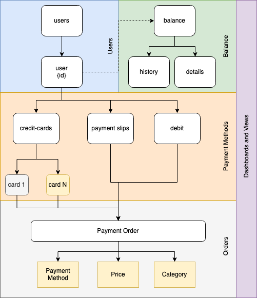

# budget-tracker-api

API REST Backend for a personal budget tracker

## Architecture

# Developer tools

## Running locally

You can use `docker-compose` to run the entire backend stack locally: `budget-tracker` and `mongodb` (with an initial `admin` user created)

The mongodb served by `docker-compose` has no credentials so it's recommended only for development purposes.

## Swagger API support

This application uses go-swagger to generate swagger specs directly from the code, to run it just:

`make swagger-spec`

The output will be a local `./docs/swagger.yaml` file which can be used along with external applications such as insomnia designer. In case of side-by-side UI containers such as `swagger-ui` you can serve the following endpoint: `/swagger.yaml`

## Insomnia

Download `./docs/insomnia.json` file and upload it to your insomnia application in order to get all endpoints to be tested

# Observability

## Opentelemetry

This application supports opentelemetry and currently is using `jaeger` exporter
